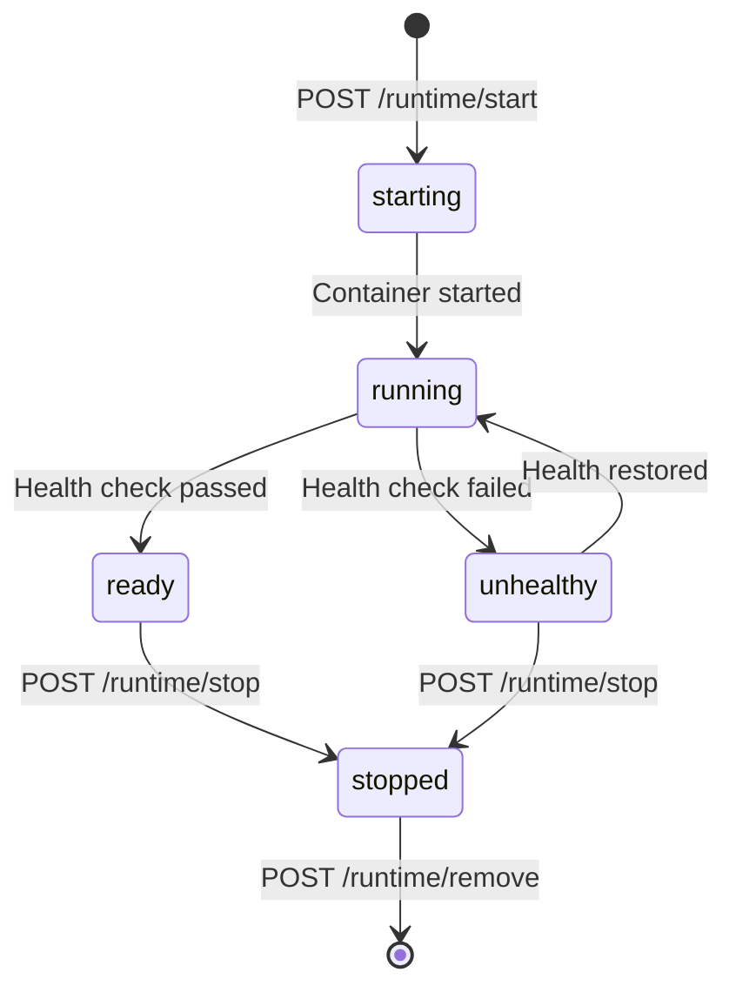

## POST /api/runtime/start

Start a model instance with the specified backend and configuration.

### Request Body

<ParamField body="model_id" type="string" required>
  Model ID to start (e.g., `"qwen2-0.5b"`)
</ParamField>

<ParamField body="alias" type="string" optional>
  User-assigned instance name. If not provided, defaults to model_id.
</ParamField>

<ParamField body="backend_type" type="BackendType" optional>
  Inference engine type: `"vllm"`, `"mindie"`, `"mlguider"`, or `"omni-infer"`. Uses default if not specified.
</ParamField>

<ParamField body="deployment_mode" type="DeploymentMode" optional>
  Deployment mode: `"docker"` or `"native"`. Currently only `"docker"` is supported.
</ParamField>

<ParamField body="interactive" type="boolean" default="false">
  Run in interactive mode
</ParamField>

<ParamField body="additional_config" type="object" optional>
  Additional backend-specific configuration options
</ParamField>

### Response (JSON mode)

<ResponseField name="instance_id" type="string" required>
  Unique instance identifier
</ResponseField>

<ResponseField name="model_id" type="string" required>
  Model ID being run
</ResponseField>

<ResponseField name="backend_type" type="string" required>
  Inference engine type
</ResponseField>

<ResponseField name="deployment_mode" type="string" required>
  Deployment mode used
</ResponseField>

<ResponseField name="port" type="integer" required>
  Port number where the instance is accessible
</ResponseField>

<ResponseField name="state" type="string" required>
  Instance state: `"starting"`, `"running"`, `"ready"`, `"stopped"`, `"unhealthy"`
</ResponseField>

### Streaming Mode (SSE)

To receive progress updates, set `Accept: text/event-stream` header:

```bash
curl -X POST http://localhost:11581/api/runtime/start \
  -H "Content-Type: application/json" \
  -H "Accept: text/event-stream" \
  -d '{
    "model_id": "qwen2-0.5b",
    "alias": "my-model"
  }'
```

SSE events:
- `data: <progress message>` - Progress updates
- `event: done` - Instance started successfully
- `event: error` - Startup failed

### Example Request

```bash
curl -X POST http://localhost:11581/api/runtime/start \
  -H "Content-Type: application/json" \
  -d '{
    "model_id": "qwen2-0.5b",
    "alias": "my-qwen-instance",
    "backend_type": "vllm",
    "deployment_mode": "docker"
  }'
```

### Example Response

```json
{
  "instance_id": "qwen2-0.5b-abc123",
  "model_id": "qwen2-0.5b",
  "backend_type": "vllm",
  "deployment_mode": "docker",
  "port": 10881,
  "state": "starting"
}
```

---

## GET /api/runtime/instances

List all running model instances.

### Query Parameters

<ParamField query="all" type="boolean" default="false">
  Show all instances including stopped ones. Default shows only active instances.
</ParamField>

### Response

<ResponseField name="instances" type="RunInstance[]" required>
  Array of running instances
</ResponseField>

### RunInstance Object

<ResponseField name="id" type="string" required>
  Unique instance identifier
</ResponseField>

<ResponseField name="alias" type="string" required>
  Instance alias (user-assigned or model_id)
</ResponseField>

<ResponseField name="model_id" type="string" required>
  Model ID
</ResponseField>

<ResponseField name="backend_type" type="string" required>
  Inference engine type
</ResponseField>

<ResponseField name="deployment_mode" type="string" required>
  Deployment mode
</ResponseField>

<ResponseField name="port" type="integer" required>
  Instance port number
</ResponseField>

<ResponseField name="state" type="string" required>
  Current state: `"starting"`, `"running"`, `"ready"`, `"stopped"`, `"unhealthy"`, `"unknown"`
</ResponseField>

<ResponseField name="created_at" type="string" required>
  Instance creation timestamp (RFC3339)
</ResponseField>

<ResponseField name="endpoint" type="string" optional>
  Full endpoint URL (e.g., `"http://localhost:10881"`)
</ResponseField>

### Example Request

```bash
curl "http://localhost:11581/api/runtime/instances"
```

### Example Response

```json
{
  "instances": [
    {
      "id": "qwen2-0.5b-abc123",
      "alias": "my-qwen-instance",
      "model_id": "qwen2-0.5b",
      "backend_type": "vllm",
      "deployment_mode": "docker",
      "port": 10881,
      "state": "ready",
      "created_at": "2026-03-05T10:00:00Z",
      "endpoint": "http://localhost:10881"
    }
  ]
}
```

---

## GET /api/runtime/check-ready

Check if a model instance is ready to serve requests.

### Query Parameters

<ParamField query="alias" type="string" required>
  Instance alias to check
</ParamField>

### Response

<ResponseField name="ready" type="boolean" required>
  Whether the instance is ready
</ResponseField>

<ResponseField name="alias" type="string" required>
  Instance alias
</ResponseField>

<ResponseField name="endpoint" type="string" optional>
  Instance endpoint URL
</ResponseField>

<ResponseField name="state" type="string" optional>
  Current instance state
</ResponseField>

<ResponseField name="message" type="string" required>
  Status message
</ResponseField>

### Example Request

```bash
curl "http://localhost:11581/api/runtime/check-ready?alias=my-qwen-instance"
```

### Example Response

```json
{
  "ready": true,
  "alias": "my-qwen-instance",
  "endpoint": "http://localhost:10881",
  "message": "Instance is ready"
}
```

---

## POST /api/runtime/stop

Stop a running model instance.

### Request Body

<ParamField body="alias" type="string" required>
  Instance alias to stop
</ParamField>

<ParamField body="instance_id" type="string" deprecated>
  (Deprecated) Use `alias` instead
</ParamField>

<ParamField body="force" type="boolean" default="false">
  Force stop even if instance is unhealthy
</ParamField>

### Response

<ResponseField name="message" type="string" required>
  Success message
</ResponseField>

### Example Request

```bash
curl -X POST http://localhost:11581/api/runtime/stop \
  -H "Content-Type: application/json" \
  -d '{"alias": "my-qwen-instance"}'
```

### Example Response

```json
{
  "message": "Instance stopped successfully"
}
```

---

## POST /api/runtime/remove

Remove a model instance (must be stopped first).

### Request Body

<ParamField body="alias" type="string" required>
  Instance alias to remove
</ParamField>

<ParamField body="instance_id" type="string" deprecated>
  (Deprecated) Use `alias` instead
</ParamField>

<ParamField body="force" type="boolean" default="false">
  Force removal even if instance is running
</ParamField>

### Response

<ResponseField name="message" type="string" required>
  Success message
</ResponseField>

### Example Request

```bash
curl -X POST http://localhost:11581/api/runtime/remove \
  -H "Content-Type: application/json" \
  -d '{"alias": "my-qwen-instance", "force": false}'
```

---

## GET /api/runtime/logs

Stream logs from a running instance.

### Query Parameters

<ParamField query="alias" type="string" required>
  Instance alias
</ParamField>

<ParamField query="follow" type="boolean" default="true">
  Follow log output (streaming mode)
</ParamField>

### Response

Returns logs as `text/plain` stream. When `follow=true`, keeps connection open and streams new logs.

### Example Request

```bash
# Stream logs (follow mode)
curl "http://localhost:11581/api/runtime/logs?alias=my-qwen-instance&follow=true"

# Get existing logs only
curl "http://localhost:11581/api/runtime/logs?alias=my-qwen-instance&follow=false"
```

---

## Instance Lifecycle



### State Descriptions

- **starting**: Container is being created and started
- **running**: Container is running, health checks in progress
- **ready**: Instance is healthy and ready to serve requests
- **unhealthy**: Instance is running but failing health checks
- **stopped**: Instance has been stopped
- **unknown**: State cannot be determined

---

## Error Responses

```json
{
  "error": "No running instance found for model: invalid-model",
  "code": "404"
}
```

### Common Error Codes

- `400` - Invalid request body or parameters
- `404` - Instance not found
- `500` - Failed to start/stop instance
- `503` - Service unavailable (concurrency limit reached)
