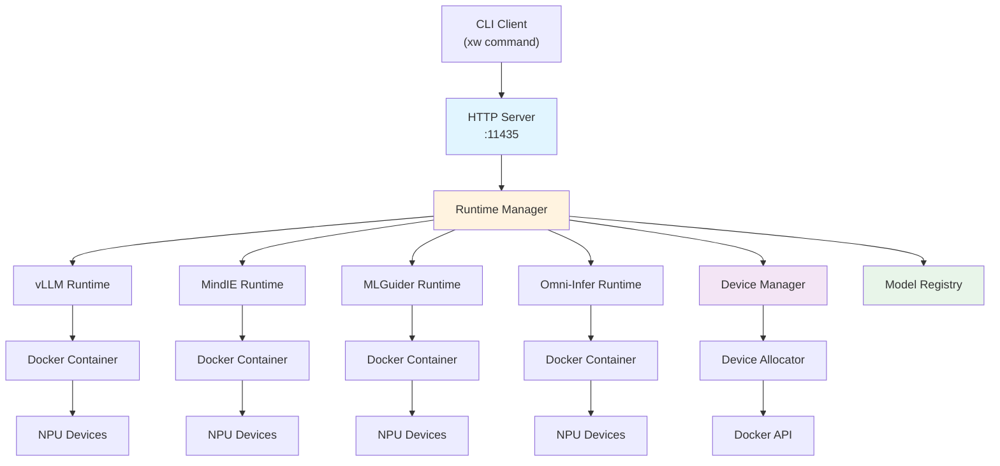
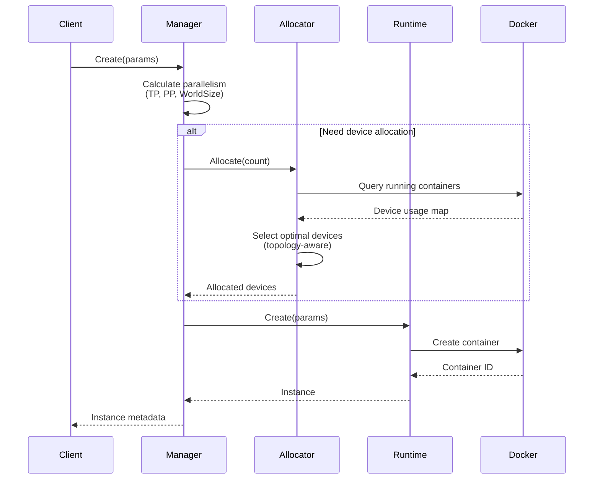
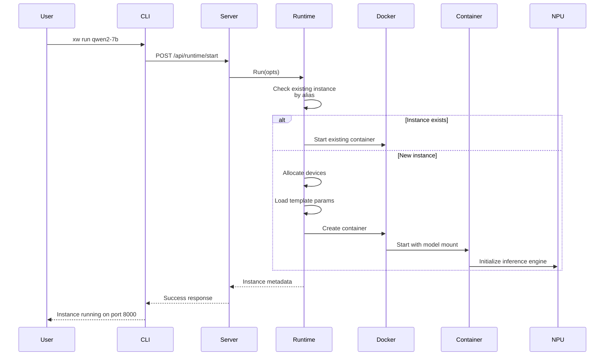
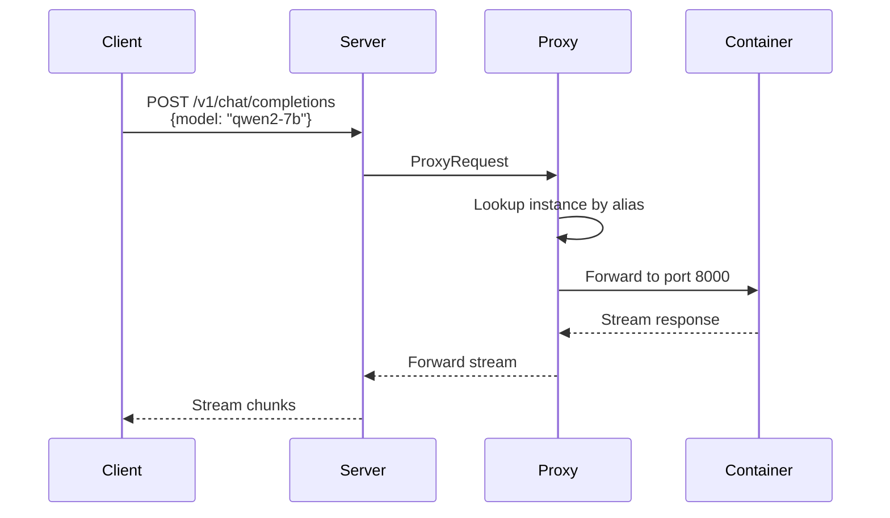

XW CLI is a comprehensive system for deploying and managing large language models on domestic Chinese AI accelerators. This page explains the core architecture and how components work together.

## High-Level Architecture

The system follows a client-server architecture with modular runtime backends:



## Core Components

### HTTP Server

The server provides a RESTful API for all operations:

<CardGroup cols={2}>
  <Card title="Management API" icon="gear">
    Model listing, pulling, version management, and configuration
  </Card>
  <Card title="Runtime API" icon="play">
    Instance creation, starting, stopping, and log streaming
  </Card>
  <Card title="Inference API" icon="message">
    OpenAI-compatible chat completions and embeddings
  </Card>
  <Card title="Device API" icon="microchip">
    Hardware detection and device information
  </Card>
</CardGroup>

**Key Features:**
- Persistent long-lived service
- Graceful shutdown support
- Request logging and monitoring
- Server-Sent Events (SSE) for progress streaming

**Source:** `internal/server/server.go:38-270`

### Runtime Manager

The Runtime Manager (`internal/runtime/manager.go`) orchestrates multiple inference engines and handles the complete lifecycle of model instances.

#### Responsibilities

1. **Runtime Registration:** Manages multiple runtime implementations (vLLM, MindIE, MLGuider, Omni-Infer)
2. **Device Allocation:** Coordinates with Device Allocator for hardware assignment
3. **Parallelism Management:** Handles tensor parallel and pipeline parallel configurations
4. **Instance Lifecycle:** Create, start, stop, remove operations across all runtimes
5. **Template Parameters:** Applies runtime-specific configuration from `runtime_params.yaml`

#### Instance Creation Flow



**Key Code:** `internal/runtime/manager.go:129-279`

#### Parallelism Parameter Management

The manager implements unified parallelism logic with multiple sources:

<Info>
**Priority Order:**
1. Explicit `--tp` flag → allocate that many devices
2. Explicit `--device` flag → use device count as world_size
3. Template `world_size` parameter → allocate from template
4. No specification → world_size=0, no devices
</Info>

**Constraints:**
- Valid values: 0, 1, 2, 4, or 8 devices
- WorldSize = TensorParallel × PipelineParallel
- If both `--tp` and `--device` specified, they must match

**Source:** `internal/runtime/manager.go:149-268`

### Device Manager

The Device Manager provides hardware detection and metadata for AI accelerators.

<CardGroup cols={2}>
  <Card title="PCI Device Scanning" icon="magnifying-glass">
    Scans `/sys/bus/pci/devices` for AI chip vendor/device IDs
  </Card>
  <Card title="Chip Identification" icon="fingerprint">
    Matches against known chips in `configs/devices.yaml`
  </Card>
  <Card title="Variant Detection" icon="code-branch">
    Distinguishes sub-models via subsystem_device_id
  </Card>
  <Card title="Thread-Safe Access" icon="lock">
    Concurrent device queries with RWMutex
  </Card>
</CardGroup>

**Source:** `internal/device/manager.go:50-350`

#### Detection Process

The manager uses PCI scanning to identify chips:

```go
// From internal/device/manager.go:108-145
func (m *Manager) detectDevices() {
    // Scan for actual AI chips via PCI
    chips, err := FindAIChips()
    
    // Convert detected chips to Device entries
    for _, chipList := range chips {
        firstChip := chipList[0]
        deviceType := firstChip.DeviceType
        
        device := &Device{
            Type:      deviceType,
            Name:      firstChip.ModelName,
            Available: true,
            Properties: map[string]string{
                "count":      fmt.Sprintf("%d", len(chipList)),
                "generation": firstChip.Generation,
            },
        }
        m.devices[deviceType] = device
    }
}
```

### Device Allocator

The allocator manages device assignment with topology awareness.

#### Dynamic Allocation Strategy

<Note>
Unlike traditional allocators that maintain a state file, XW queries Docker directly to determine device availability. This ensures allocation state is always accurate, even after server restarts.
</Note>

**Allocation Algorithm:**

1. Query Docker API for running containers with `xw.runtime` label
2. Extract device indices from `xw.device_indices` label
3. Determine free devices by comparing with detected hardware
4. Group free devices by chip model (ConfigKey)
5. Apply topology-aware selection within chip model
6. Return optimal device set

**Source:** `internal/device/allocator.go:224-289`

#### Topology-Aware Allocation

The allocator optimizes device placement for high-speed interconnects:

```go
// From internal/device/allocator.go:308-351
func (a *Allocator) selectBestDevices(freeIndices []int, count int, configKey string) []int {
    topology := a.topologyByType[configKey]
    
    // Find chips all in same box (distance = 0)
    bestIndices := freeIndices[:count]
    bestDistance := a.calculateTotalDistance(bestIndices, topology)
    
    if bestDistance == 0 {
        // Optimal: all chips in same high-speed box
        return bestIndices
    }
    
    // Try different combinations to minimize distance
    for start := 1; start < maxAttempts; start++ {
        candidate := freeIndices[start : start+count]
        distance := a.calculateTotalDistance(candidate, topology)
        
        if distance < bestDistance {
            bestDistance = distance
            bestIndices = candidate
        }
    }
    
    return bestIndices
}
```

**Distance Calculation:**
- Same topology box: distance = 0 (HCCS/NVLink)
- Different boxes: distance = |box_a - box_b|
- Unknown topology: distance = 999 (avoid)

**Configuration:** Topology defined in `configs/devices.yaml`:

```yaml
topology:
  boxes:
    - devices: [0, 1, 2, 3]  # High-speed interconnect group 1
    - devices: [4, 5, 6, 7]  # High-speed interconnect group 2
```

### Model Registry

The registry manages the catalog of available AI models.

<CardGroup cols={2}>
  <Card title="Model Specifications" icon="book">
    ModelSpec with ID, parameters, context length, device support
  </Card>
  <Card title="Device Mapping" icon="map">
    Maps device types to supported backends and engines
  </Card>
  <Card title="Dual Lookup" icon="search">
    Find by internal ID or external source ID (ModelScope)
  </Card>
  <Card title="Runtime Integration" icon="plug">
    Provides backend options and deployment priorities
  </Card>
</CardGroup>

**Model Specification Structure:**

```go
// From internal/models/spec.go:44-87
type ModelSpec struct {
    ID              string   // Internal identifier (e.g., "qwen2-7b")
    SourceID        string   // ModelScope ID (e.g., "Qwen/Qwen2-7B")
    Parameters      float64  // Billions of parameters
    ContextLength   int      // Max tokens
    EmbeddingLength int      // Embedding dimension
    
    // Device → Backend mapping
    SupportedDevices map[api.DeviceType][]BackendOption
    
    Tag          string   // Variant ("int8", "fp16", etc.)
    Capabilities []string // Features ("completion", "vision", etc.)
}
```

**Source:** `internal/models/registry.go:23-493`

## Configuration System

XW uses a versioned configuration system with YAML files:

### Configuration Files

<CardGroup cols={3}>
  <Card title="devices.yaml" icon="microchip">
    Hardware definitions, PCI IDs, Docker images, sandbox configs
  </Card>
  <Card title="models.yaml" icon="database">
    Model metadata, download sources, device compatibility
  </Card>
  <Card title="runtime_params.yaml" icon="sliders">
    Engine-specific templates with environment variables
  </Card>
</CardGroup>

**Location:** `~/.xw/{version}/` or `/etc/xw/{version}/`

### Configuration-Driven Device Support

XW uses an **ext_sandboxes** system that defines device behavior in YAML:

```yaml
# From configs/0.0.3/devices.yaml
ext_sandboxes:
  # Common config (shared by all engines)
  devices:
    - /dev/davinci0      # Auto-matched by index
    - /dev/davinci1
    - /dev/davinci_manager  # Always mounted
  volumes:
    - /usr/local/Ascend/driver:/usr/local/Ascend/driver
  runtime: runc
  
  # Engine-specific configs
  vllm:
    device_env: ASCEND_RT_VISIBLE_DEVICES
    privileged: true
    shm_size_gb: 100
```

<Info>
**Benefits:**
- Add new chips without code changes
- Quick driver path updates
- User customization support
- Faster iteration cycles
</Info>

## Data Flow

### Model Execution Request



### Inference Request (OpenAI API)



## State Management

### Container-Based State

XW stores all state in Docker container labels:

```go
// Container labels (internal/runtime/docker_base.go)
labels := map[string]string{
    "xw.runtime":        runtimeName,
    "xw.instance_id":    instanceID,
    "xw.model_id":       modelID,
    "xw.device_indices": "0,1,2,3",  // Allocated devices
    "xw.backend_type":   "vllm",
    "xw.deployment_mode": "docker",
}
```

<Note>
This approach eliminates state file synchronization issues. The Docker daemon becomes the single source of truth for instance state.
</Note>

### State Persistence

- **Container lifecycle** → Instance state (running/stopped/error)
- **Container labels** → Metadata (model, devices, backend)
- **Device allocation** → Derived from running containers
- **Health checks** → HTTP endpoint polling

## Extension Points

### Adding New Runtime Engines

1. Implement `runtime.Runtime` interface
2. Register in `NewManager()`
3. Add image configuration in `devices.yaml`
4. Define ext_sandbox if needed

### Adding New Device Types

1. Add vendor/chip to `devices.yaml` with PCI IDs
2. Define ext_sandbox configuration
3. Specify runtime images per architecture
4. Configure topology if multi-chip

### Custom Model Sources

1. Create `ModelSpec` instance
2. Call `RegisterModelSpec()` in init()
3. Implement download logic if non-standard source

## Performance Considerations

### Topology-Aware Allocation

<CardGroup cols={2}>
  <Card title="Same Box" icon="bolt">
    Distance = 0: Maximum bandwidth via HCCS/NVLink
  </Card>
  <Card title="Cross Box" icon="arrow-right-arrow-left">
    Distance > 0: PCIe/network communication overhead
  </Card>
</CardGroup>

For 8-device models, same-box allocation can improve throughput by 2-3x.

### Container Resource Limits

Shared memory sizes per engine:
- **vLLM:** 100GB (default)
- **MindIE:** 100GB (default)
- **MLGuider:** 100GB (default)
- **Omni-Infer:** 500GB (large model support)

**Source:** `configs/0.0.3/devices.yaml`

## Next Steps

<CardGroup cols={2}>
  <Card title="Runtime Engines" href="/concepts/runtime-engines" icon="gears">
    Deep dive into vLLM, MindIE, MLGuider, and Omni-Infer
  </Card>
  <Card title="Device Support" href="/concepts/device-support" icon="microchip">
    Hardware detection, topology, and allocation
  </Card>
  <Card title="Model Management" href="/concepts/model-management" icon="database">
    Registry, pulling, and versioning system
  </Card>
  <Card title="CLI Reference" href="/cli/serve" icon="terminal">
    Command-line interface documentation
  </Card>
</CardGroup>