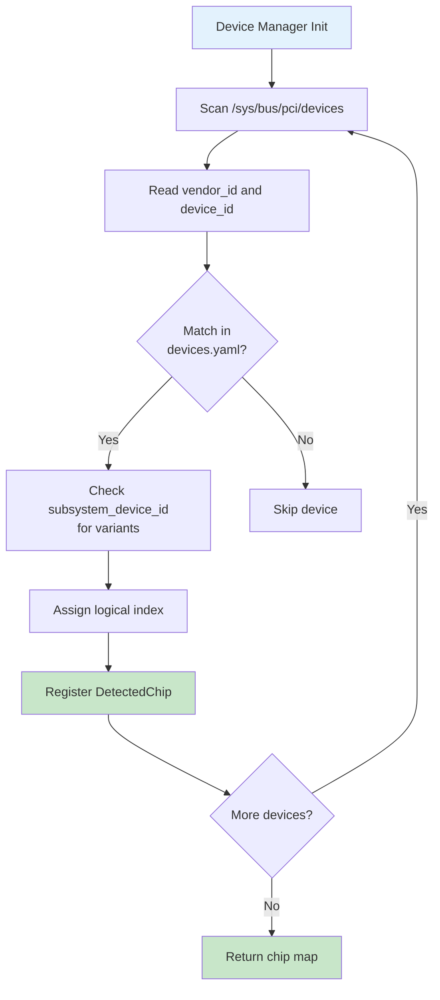
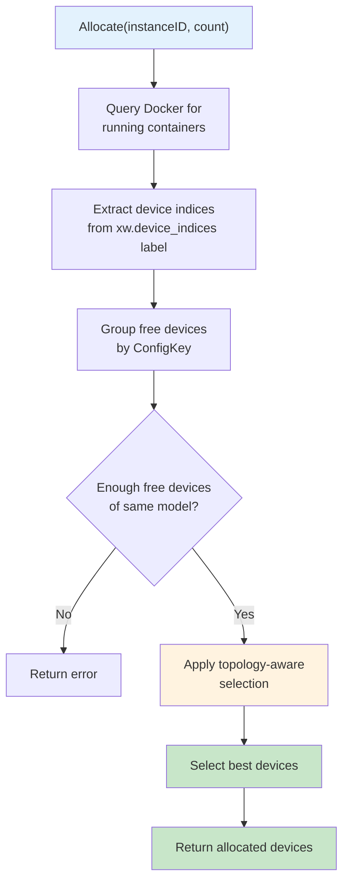

XW CLI provides comprehensive support for domestic Chinese AI accelerators with automatic hardware detection, intelligent device allocation, and topology optimization.

## Supported Hardware

<CardGroup cols={2}>
  <Card title="Huawei Ascend 910B" icon="microchip">
    High-performance NPU for training and inference (8 cards)
  </Card>
  <Card title="Huawei Ascend 310P" icon="processor">
    Inference-optimized NPU with dual-chip cards (4×2 chips)
  </Card>
  <Card title="MetaX C550" icon="cube">
    GPU-like accelerator with DRI interface
  </Card>
  <Card title="Extensible" icon="plus">
    Add new chips via YAML configuration
  </Card>
</CardGroup>

## Hardware Detection

### PCI Device Scanning

XW detects AI accelerators by scanning PCI devices and matching against known vendor/device IDs:



### Detection Implementation

From `internal/device/manager.go:108-145`:

```go
func (m *Manager) detectDevices() {
    // Scan for actual AI chips via PCI
    chips, err := FindAIChips()
    if err != nil {
        return
    }

    // Convert detected chips to Device entries
    for _, chipList := range chips {
        if len(chipList) == 0 {
            continue
        }

        // Get the first chip for metadata
        firstChip := chipList[0]
        deviceType := firstChip.DeviceType

        device := &Device{
            Type:      deviceType,
            Name:      firstChip.ModelName,
            Available: true,
            Properties: map[string]string{
                "count":      fmt.Sprintf("%d", len(chipList)),
                "generation": firstChip.Generation,
            },
        }

        m.devices[deviceType] = device
    }
}
```

### PCI Identification

Chips are identified via PCI vendor and device IDs defined in `configs/devices.yaml`:

```yaml
vendors:
  # Huawei Ascend NPU Series
  - vendor_name: Huawei
    vendor_id: "0x19e5"
    
    chip_models:
      # Ascend 910B
      - config_key: ascend-910b
        model_name: Ascend 910B
        device_id: "0xd802"
        generation: Ascend 9xx
      
      # Ascend 310P
      - config_key: ascend-310p
        model_name: Ascend 310P
        device_id: "0xd500"
        generation: Ascend 3xx
        chips_per_device: 2  # Dual-chip card
  
  # MetaX
  - vendor_name: Metax
    vendor_id: "0x9999"
    
    chip_models:
      - config_key: metax-c550
        model_name: Metax C550
        device_id: "0x4000"
```

**Source:** `configs/0.0.3/devices.yaml:11-254`

## Chip Variants

### Subsystem Device ID Matching

Some chip models have multiple variants (e.g., 910B1, 910B2, 910B4) distinguished by subsystem_device_id:

```yaml
chip_models:
  - config_key: ascend-910b
    model_name: Ascend 910B
    device_id: "0xd802"
    
    # Variants with different subsystem IDs
    variants:
      - subsystem_device_id: "0x3001"
        variant_key: "ascend-910b1"
        variant_name: "910B1"
      
      - subsystem_device_id: "0x4000"
        variant_key: "ascend-910b4"
        variant_name: "910B4"
```

**Source:** `configs/0.0.3/devices.yaml:18-38`

### Three-Phase Matching Logic

From `configs/0.0.3/devices.yaml:263-270`:

<Steps>
  <Step title="Phase 1: Variant Match">
    If chip model has variants, try to match subsystem_device_id
    
    → Returns variant config (variant_key, variant_name)
  </Step>
  
  <Step title="Phase 2: Base Model Fallback">
    If no variant matched, use base model config
    
    → Returns base config (config_key, model_name)
  </Step>
  
  <Step title="Phase 3: Unknown Device">
    If no model matched at all
    
    → Returns nil (device ignored)
  </Step>
</Steps>

<Info>
This graceful degradation allows new hardware variants to work with base configuration before specific variant support is added.
</Info>

## Device Manager API

### Core Operations

<CardGroup cols={2}>
  <Card title="ListAvailable" icon="list">
    Returns all currently available devices
  </Card>
  <Card title="IsAvailable" icon="circle-check">
    Checks if specific device type is available
  </Card>
  <Card title="GetDevice" icon="magnifying-glass">
    Retrieves detailed info for a device type
  </Card>
  <Card title="ListDetectedChips" icon="microchip">
    Returns per-chip information with PCI addresses
  </Card>
</CardGroup>

### Example Usage

```go
// From internal/device/manager.go:168-180
func (m *Manager) ListAvailable() []*Device {
    m.mu.RLock()
    defer m.mu.RUnlock()

    var result []*Device
    for _, device := range m.devices {
        if device.Available {
            result = append(result, device)
        }
    }

    return result
}
```

**CLI Command:**
```bash
# List detected devices
xw device list

# Output:
# Available Devices:
#   Type: ascend-910b
#   Name: Ascend 910B
#   Count: 8
#   Generation: Ascend 9xx
```

## Device Allocator

### Dynamic Allocation Strategy

The allocator manages device assignment with topology awareness and Docker-based state tracking.

<Note>
Unlike traditional allocators with state files, XW queries Docker containers directly for device availability. This ensures allocation state is always accurate, even after server restarts.
</Note>

### Allocation Algorithm

From `internal/device/allocator.go:224-289`:



### Implementation

```go
// From internal/device/allocator.go:224-289
func (a *Allocator) Allocate(instanceID string, count int) ([]DeviceInfo, error) {
    a.mu.Lock()
    defer a.mu.Unlock()

    // Get currently allocated devices from Docker containers
    allocatedDevices, err := a.getAllocatedDevicesFromDocker()
    if err != nil {
        logger.Warn("Failed to query Docker: %v", err)
        allocatedDevices = make(map[int]bool)
    }

    // Group free devices by ConfigKey (chip model)
    freeByConfigKey := make(map[string][]int)
    for i := range a.devices {
        if !allocatedDevices[i] {
            configKey := a.devices[i].ConfigKey
            freeByConfigKey[configKey] = append(freeByConfigKey[configKey], i)
        }
    }

    // Find a chip model with enough free devices
    var selectedConfigKey string
    var freeIndices []int
    for configKey, indices := range freeByConfigKey {
        if len(indices) >= count {
            selectedConfigKey = configKey
            freeIndices = indices
            break
        }
    }

    // Check if enough free devices available
    if len(freeIndices) < count {
        return nil, fmt.Errorf("insufficient free devices")
    }

    // Select best devices using topology-aware allocation
    allocatedIndices := a.selectBestDevices(freeIndices, count, selectedConfigKey)

    // Prepare result
    result := make([]DeviceInfo, len(allocatedIndices))
    for i, idx := range allocatedIndices {
        result[i] = a.devices[idx]
    }

    return result, nil
}
```

## Topology-Aware Allocation

### Topology Configuration

High-speed interconnects (HCCS for Ascend, NVLink for NVIDIA) are defined via topology boxes:

```yaml
# From configs/0.0.3/devices.yaml:40-44
topology:
  boxes:
    - devices: [0, 1, 2, 3]  # Group 1: Cards 0-3 interconnected
    - devices: [4, 5, 6, 7]  # Group 2: Cards 4-7 interconnected
```

### Distance Calculation

From `internal/device/allocator.go:83-108`:

```go
func (dt *DeviceTopology) GetDistance(chipA, chipB int) int {
    if dt == nil {
        // No topology configured, all chips have equal distance
        return 0
    }
    
    boxA, okA := dt.chipToBox[chipA]
    boxB, okB := dt.chipToBox[chipB]
    
    // If either chip is not in topology, assign high distance
    if !okA || !okB {
        return 999
    }
    
    // Same box = zero distance
    if boxA == boxB {
        return 0
    }
    
    // Different boxes = box index difference
    diff := boxA - boxB
    if diff < 0 {
        diff = -diff
    }
    return diff
}
```

**Distance Rules:**
- Same topology box: distance = **0** (high-speed interconnect)
- Different boxes: distance = **|box_a - box_b|**
- Unknown chip: distance = **999** (avoid allocation)

### Optimal Device Selection

From `internal/device/allocator.go:308-351`:

```go
func (a *Allocator) selectBestDevices(freeIndices []int, count int, configKey string) []int {
    topology := a.topologyByType[configKey]
    
    // No topology or single chip: use simple selection
    if topology == nil || count == 1 {
        return freeIndices[:count]
    }
    
    // Try to find chips all in same box (distance = 0)
    bestIndices := freeIndices[:count]
    bestDistance := a.calculateTotalDistance(bestIndices, topology)
    
    // If best distance is already 0, we found optimal allocation
    if bestDistance == 0 {
        logger.Debug("Found %d chips in same box (distance=0)", count)
        return bestIndices
    }
    
    // Try different combinations to find better allocation
    for start := 1; start < maxAttempts; start++ {
        candidate := freeIndices[start : start+count]
        distance := a.calculateTotalDistance(candidate, topology)
        
        if distance < bestDistance {
            bestDistance = distance
            bestIndices = candidate
            
            // Found optimal allocation (same box)
            if bestDistance == 0 {
                break
            }
        }
    }
    
    return bestIndices
}
```

### Performance Impact

<CardGroup cols={2}>
  <Card title="Same Box (Distance = 0)" icon="bolt">
    **Maximum bandwidth** via HCCS/NVLink
    
    2-3x throughput improvement for 8-device models
  </Card>
  
  <Card title="Cross Box (Distance > 0)" icon="arrow-right-arrow-left">
    **PCIe/network communication**
    
    Increased latency and reduced throughput
  </Card>
</CardGroup>

## Multi-Chip Cards

### Dual-Chip Configuration

Some accelerators (e.g., Ascend 310P) have multiple AI chips per PCI device:

```yaml
# From configs/0.0.3/devices.yaml:119-131
chip_models:
  - config_key: ascend-310p
    model_name: Ascend 310P
    device_id: "0xd500"
    chips_per_device: 2  # Each PCI device contains 2 AI chips
    
    # Topology: Chips on same physical card are interconnected
    topology:
      boxes:
        - devices: [0, 1]  # Physical card 0
        - devices: [2, 3]  # Physical card 1
        - devices: [4, 5]  # Physical card 2
        - devices: [6, 7]  # Physical card 3
```

### Logical vs Physical Indexing

<Info>
XW uses **logical chip indices** for user-facing operations, abstracting away the physical PCI device structure.
</Info>

**Example:** 4 physical cards with 2 chips each:
- Physical devices: 0, 1, 2, 3 (PCI addresses)
- Logical chips: 0, 1, 2, 3, 4, 5, 6, 7 (user-visible indices)

**CLI Usage:**
```bash
# Allocate chips 0-3 (spans 2 physical cards)
xw run qwen2-7b --device 0,1,2,3

# Allocate chips 0-1 (single physical card, optimal)
xw run qwen2-7b --device 0,1
```

## Device Configuration

### Extended Sandboxes (ext_sandboxes)

Device-specific behavior is defined in YAML configuration:

```yaml
# From configs/0.0.3/devices.yaml:56-116
ext_sandboxes:
  # Common configuration (shared by all engines)
  devices:
    # Individual NPU devices (auto-matched by index)
    - /dev/davinci0
    - /dev/davinci1
    - /dev/davinci2
    - /dev/davinci3
    # Common Ascend devices (always mounted)
    - /dev/davinci_manager
    - /dev/devmm_svm
    - /dev/hisi_hdc
  
  volumes:
    - /usr/local/dcmi:/usr/local/dcmi
    - /usr/local/bin/npu-smi:/usr/local/bin/npu-smi
    - /usr/local/Ascend/driver/lib64/:/usr/local/Ascend/driver/lib64/
    - /root/.cache:/root/.cache
  
  runtime: runc
  
  # Engine-specific configurations
  vllm:
    device_env: ASCEND_RT_VISIBLE_DEVICES
    environment:
      ASCEND_VISIBLE_DEVICES: "0,1,2,3,4,5,6,7"
      ASCEND_SLOG_PRINT_TO_STDOUT: "1"
      ASCEND_GLOBAL_LOG_LEVEL: "3"
    privileged: true
    shm_size_gb: 100
    capabilities:
      - SYS_ADMIN
      - SYS_RAWIO
      - IPC_LOCK
      - SYS_RESOURCE
```

### Device Mounting Rules

From `configs/0.0.3/devices.yaml:302-306`:

**Per-Device Paths:**
- Paths ending with a digit (e.g., `/dev/davinci0`) are auto-matched by device index
- Only allocated device indices are mounted

**Shared Paths:**
- Paths not ending with a digit (e.g., `/dev/davinci_manager`) are always mounted
- Required for device management and control

### Environment Variables

Each engine uses a specific variable for device visibility:

| Engine | Device Environment Variable | Format |
|--------|----------------------------|--------|
| vLLM | `ASCEND_RT_VISIBLE_DEVICES` | `0,1,2,3` |
| MindIE | `MINDIE_NPU_DEVICE_IDS` | `0,1,2,3` |
| MLGuider | `DEVICES` | `0,1,2,3` |
| Omni-Infer | `ASCEND_RT_VISIBLE_DEVICES` | `0,1,2,3` |

## Adding New Hardware

### Configuration Steps

<Steps>
  <Step title="Find PCI IDs">
    ```bash
    # List PCI devices
    lspci -nn | grep -i accelerator
    
    # Example output:
    # 0000:01:00.0 Processing accelerators [1200]: Huawei [19e5:d802]
    ```
    
    Extract vendor_id (`0x19e5`) and device_id (`0xd802`)
  </Step>
  
  <Step title="Add to devices.yaml">
    ```yaml
    vendors:
      - vendor_name: YourVendor
        vendor_id: "0xXXXX"
        
        chip_models:
          - config_key: custom-chip
            model_name: Custom AI Chip
            device_id: "0xYYYY"
            generation: Gen 1
    ```
  </Step>
  
  <Step title="Define ext_sandboxes">
    ```yaml
    ext_sandboxes:
      devices:
        - /dev/custom0
        - /dev/custom_ctrl
      volumes:
        - /usr/local/custom/driver:/usr/local/custom/driver
      runtime: runc
      
      vllm:
        device_env: CUSTOM_VISIBLE_DEVICES
        privileged: true
        shm_size_gb: 100
    ```
  </Step>
  
  <Step title="Add runtime images">
    ```yaml
    runtime_images:
      vllm:
        arm64: harbor.example.com/vllm-custom:latest
        amd64: NONE
    ```
  </Step>
  
  <Step title="Test detection">
    ```bash
    # Restart XW server
    xw stop
    xw start
    
    # Verify detection
    xw device list
    ```
  </Step>
</Steps>

<Info>
No code changes required! All hardware support is configuration-driven.
</Info>

## State Management

### Container-Based Tracking

Device allocation state is stored in Docker container labels:

```go
// Container labels track device assignment
labels := map[string]string{
    "xw.runtime":        "vllm:docker",
    "xw.instance_id":    "qwen2-7b",
    "xw.device_indices": "0,1,2,3",  // Allocated devices
}
```

### Querying Allocations

From `internal/device/allocator.go:402-435`:

```go
func (a *Allocator) getAllocatedDevicesFromDocker() (map[int]bool, error) {
    // Query for all xw-managed containers
    containers, err := a.dockerClient.ContainerList(ctx, container.ListOptions{
        All: true,
        Filters: filters.NewArgs(
            filters.Arg("label", "xw.runtime"),
        ),
    })

    allocated := make(map[int]bool)

    for _, c := range containers {
        // Only count running containers
        if c.State != "running" {
            continue
        }

        // Extract device indices from labels
        if deviceIndicesStr, ok := c.Labels["xw.device_indices"]; ok {
            indices := parseDeviceIndices(deviceIndicesStr)
            for _, idx := range indices {
                allocated[idx] = true
            }
        }
    }

    return allocated, nil
}
```

<Note>
This approach eliminates state file synchronization issues. The Docker daemon is the single source of truth.
</Note>

## Troubleshooting

### Device Not Detected

<AccordionGroup>
  <Accordion title="Check PCI visibility">
    ```bash
    # List all PCI devices
    lspci -nn
    
    # Check sysfs
    ls /sys/bus/pci/devices/
    ```
  </Accordion>
  
  <Accordion title="Verify vendor/device ID">
    ```bash
    # Get IDs for specific device
    cat /sys/bus/pci/devices/0000:01:00.0/vendor
    cat /sys/bus/pci/devices/0000:01:00.0/device
    ```
  </Accordion>
  
  <Accordion title="Check configuration">
    ```bash
    # Verify devices.yaml syntax
    cat ~/.xw/0.0.3/devices.yaml
    
    # Check XW logs
    xw logs xw-server
    ```
  </Accordion>
</AccordionGroup>

### Allocation Failures

<AccordionGroup>
  <Accordion title="Check device availability">
    ```bash
    # List available devices
    xw device list
    
    # Check running instances
    xw ps
    ```
  </Accordion>
  
  <Accordion title="Verify Docker containers">
    ```bash
    # List xw containers
    docker ps --filter label=xw.runtime
    
    # Check device labels
    docker inspect <container_id> --format '{{.Config.Labels}}'
    ```
  </Accordion>
</AccordionGroup>

## Next Steps

<CardGroup cols={2}>
  <Card title="Runtime Engines" href="/concepts/runtime-engines" icon="gears">
    Learn about inference engine backends
  </Card>
  <Card title="Architecture" href="/concepts/architecture" icon="diagram-project">
    Understand the system architecture
  </Card>
  <Card title="Model Management" href="/concepts/model-management" icon="database">
    Explore model registry and pulling
  </Card>
  <Card title="Device CLI" href="/cli/device" icon="terminal">
    Device management commands
  </Card>
</CardGroup>