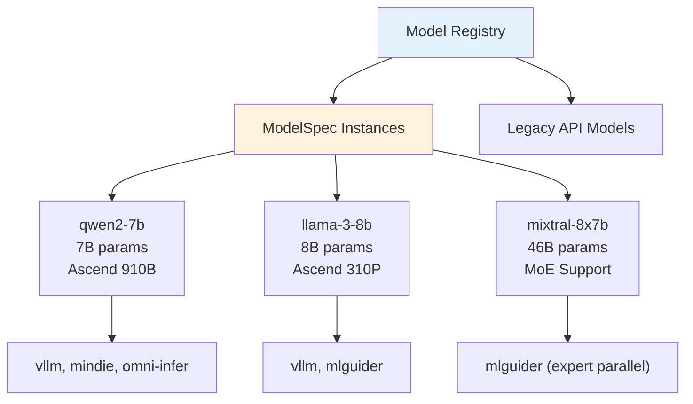
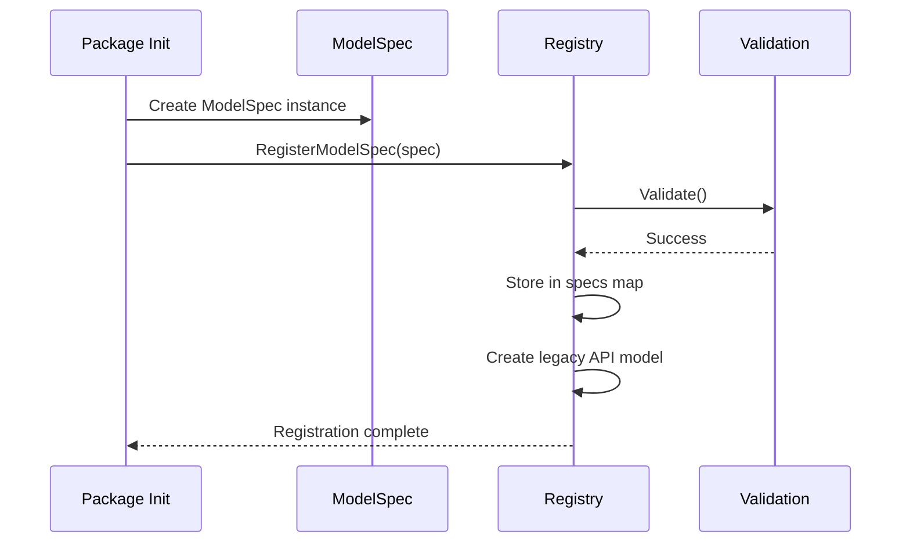
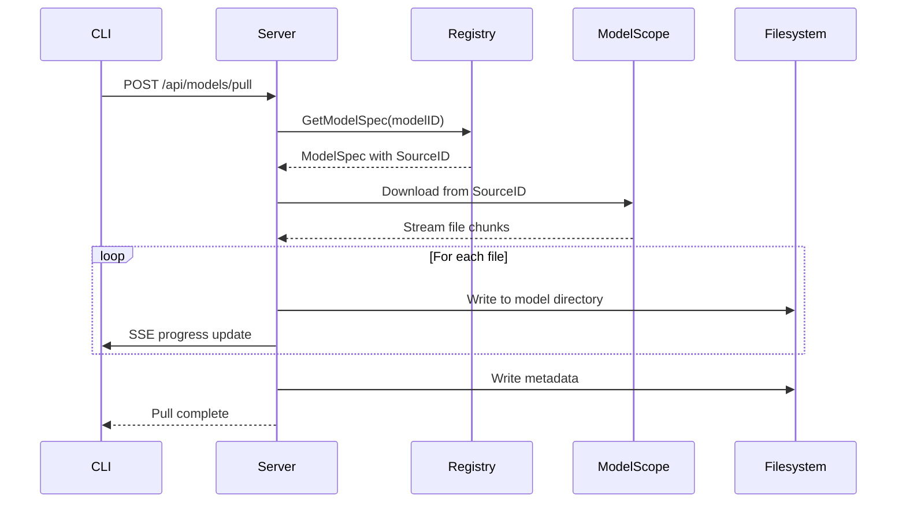

XW CLI provides a comprehensive model management system with registry-based discovery, automatic pulling from ModelScope, and flexible specification framework.

## Model Registry

The registry manages the catalog of available AI models with device compatibility and backend support.

### Registry Architecture



### Model Specification Structure

From `internal/models/spec.go:44-87`:

```go
type ModelSpec struct {
    // Model identification
    ID       string  // Internal identifier (e.g., "qwen2-7b")
    SourceID string  // ModelScope ID (e.g., "Qwen/Qwen2-7B")
    
    // Model specifications
    Parameters      float64  // Billions of parameters
    ContextLength   int      // Max tokens
    EmbeddingLength int      // Embedding dimension
    
    // Deployment configuration
    SupportedDevices map[api.DeviceType][]BackendOption
    
    // Variant and features
    Tag          string   // Quantization ("int8", "fp16", etc.)
    Capabilities []string // Features ("completion", "vision", etc.)
}
```

### Backend Options

Each device type has an ordered list of backend options:

```go
// From internal/models/spec.go:14-42
type BackendOption struct {
    Type     api.BackendType      // "vllm", "mindie", etc.
    Mode     api.DeploymentMode   // "docker" or "native"
    Command  []string             // Container command (optional)
    Priority int                  // Lower = higher priority
}
```

**Priority Selection:**
- Backends are tried sequentially until one succeeds
- Docker modes typically listed first for easier deployment
- Native modes available for advanced use cases

## Model Registration

### Registration Flow



### Registration Implementation

From `internal/models/registry.go:459-492`:

```go
func RegisterModelSpec(spec *ModelSpec) {
    if spec == nil {
        return
    }
    if err := spec.Validate(); err != nil {
        logger.Warn("Invalid model spec for %s: %v", spec.ID, err)
        return
    }
    
    defaultRegistry.mu.Lock()
    defer defaultRegistry.mu.Unlock()
    
    if defaultRegistry.specs == nil {
        defaultRegistry.specs = make(map[string]*ModelSpec)
    }
    defaultRegistry.specs[spec.ID] = spec
    
    // Extract device types for API model
    devices := make([]api.DeviceType, 0, len(spec.SupportedDevices))
    for device := range spec.SupportedDevices {
        devices = append(devices, device)
    }
    
    // Create legacy API model for backwards compatibility
    apiModel := &api.Model{
        Name:             spec.ID,
        Version:          spec.Tag,
        Size:             int64(spec.Parameters * 2 * 1000000000),
        SupportedDevices: devices,
    }
    defaultRegistry.models[spec.ID] = apiModel
}
```

### Example Model Registration

```go
// Example from internal/model/qwen/qwen2.go
func init() {
    models.RegisterModelSpec(&models.ModelSpec{
        ID:              "qwen2-7b",
        SourceID:        "Qwen/Qwen2-7B",
        Parameters:      7.0,
        ContextLength:   32768,
        EmbeddingLength: 3584,
        SupportedDevices: map[api.DeviceType][]models.BackendOption{
            "ascend-910b": {
                {Type: "vllm", Mode: "docker"},
                {Type: "mindie", Mode: "docker"},
                {Type: "omni-infer", Mode: "docker"},
            },
            "ascend-310p": {
                {Type: "vllm", Mode: "docker"},
                {Type: "mlguider", Mode: "docker"},
            },
        },
        Tag:          "fp16",
        Capabilities: []string{"completion"},
    })
}
```

## Model Discovery

### Dual Lookup System

From `internal/models/registry.go:387-432`:

```go
func GetModelSpec(modelID string) *ModelSpec {
    if defaultRegistry.specs == nil {
        return nil
    }
    defaultRegistry.mu.RLock()
    defer defaultRegistry.mu.RUnlock()
    
    // First, try to find by internal ID (fast path)
    if spec, ok := defaultRegistry.specs[modelID]; ok {
        return spec
    }
    
    // If not found, search by SourceID (slow path)
    // Allows users to use ModelScope IDs directly
    for _, spec := range defaultRegistry.specs {
        if spec.SourceID == modelID {
            return spec
        }
    }
    
    return nil
}
```

<Info>
**Lookup Flexibility:**
Users can reference models by either internal ID (`qwen2-7b`) or external source ID (`Qwen/Qwen2-7B`).
</Info>

### Listing Models

<CardGroup cols={2}>
  <Card title="List All Models" icon="list">
    ```bash
    xw ls
    ```
    Returns all registered models with metadata
  </Card>
  
  <Card title="Filter by Device" icon="filter">
    ```bash
    xw ls --device ascend-910b
    ```
    Shows only models compatible with specified hardware
  </Card>
  
  <Card title="Downloaded Models" icon="download">
    ```bash
    xw ls --downloaded
    ```
    Lists locally available models
  </Card>
  
  <Card title="Show Model Details" icon="circle-info">
    ```bash
    xw show qwen2-7b
    ```
    Displays detailed model information
  </Card>
</CardGroup>

## Model Pulling

### Pull Process



### ModelScope Integration

From `internal/models/modelscope.go`:

```go
// Pull downloads a model from ModelScope
func Pull(spec *ModelSpec, destDir string, progress chan<- string) error {
    // Resolve SourceID to repository
    repoURL := fmt.Sprintf("https://modelscope.cn/api/v1/models/%s", spec.SourceID)
    
    // Download model files
    files := []string{"config.json", "pytorch_model.bin", "tokenizer.json"}
    
    for _, file := range files {
        if err := downloadFile(repoURL, file, destDir, progress); err != nil {
            return err
        }
    }
    
    // Write model metadata
    metadata := map[string]interface{}{
        "model_id":   spec.ID,
        "source_id":  spec.SourceID,
        "parameters": spec.Parameters,
        "pulled_at":  time.Now(),
    }
    
    return writeMetadata(destDir, metadata)
}
```

### Pull Command Usage

```bash
# Pull by internal ID
xw pull qwen2-7b

# Pull by ModelScope ID
xw pull Qwen/Qwen2-7B

# Pull to custom directory
xw pull qwen2-7b --output /mnt/models/qwen2-7b

# Pull with progress display
xw pull qwen2-7b --verbose
```

**Output:**
```
Pulling model qwen2-7b from ModelScope...
Downloading config.json... 100%
Downloading pytorch_model.bin... 45% (3.2GB / 7.1GB)
Downloading tokenizer.json... waiting
```

## Model Storage

### Directory Structure

```
~/.xw/models/
├── qwen2-7b/
│   ├── config.json
│   ├── pytorch_model.bin
│   ├── tokenizer.json
│   ├── tokenizer_config.json
│   └── .xw_metadata.json
├── llama-3-8b/
│   ├── config.json
│   ├── model-00001-of-00004.safetensors
│   ├── model-00002-of-00004.safetensors
│   ├── model-00003-of-00004.safetensors
│   ├── model-00004-of-00004.safetensors
│   └── .xw_metadata.json
└── mixtral-8x7b/
    └── ...
```

### Metadata Format

```json
// .xw_metadata.json
{
  "model_id": "qwen2-7b",
  "source_id": "Qwen/Qwen2-7B",
  "parameters": 7.0,
  "context_length": 32768,
  "pulled_at": "2026-03-05T10:30:00Z",
  "size_bytes": 15032385536,
  "files": [
    "config.json",
    "pytorch_model.bin",
    "tokenizer.json",
    "tokenizer_config.json"
  ]
}
```

## Model Versioning

### Version Tags

Models can have multiple variants distinguished by tags:

```go
// Different quantization levels
models.RegisterModelSpec(&models.ModelSpec{
    ID:  "qwen2-7b-int8",
    Tag: "int8",  // 8-bit quantization
    // ...
})

models.RegisterModelSpec(&models.ModelSpec{
    ID:  "qwen2-7b-int4",
    Tag: "int4",  // 4-bit quantization
    // ...
})

models.RegisterModelSpec(&models.ModelSpec{
    ID:  "qwen2-7b",
    Tag: "fp16",  // Default half-precision
    // ...
})
```

### Version Selection

```bash
# Pull specific version
xw pull qwen2-7b-int8

# Run with specific version
xw run qwen2-7b-int8 --backend vllm

# Default version (fp16)
xw run qwen2-7b
```

## Device Compatibility

### Compatibility Matrix

From `internal/models/registry.go:257-292`:

```go
func (r *Registry) supportsDevice(model *api.Model, deviceType api.DeviceType) bool {
    // Try direct match first
    for _, dt := range model.SupportedDevices {
        if dt == deviceType {
            return true
        }
    }
    
    // If direct match fails, try base config_key for variants
    devConfig, err := config.LoadDevicesConfig()
    if err != nil {
        return false
    }
    
    // Check if deviceType is a variant
    for _, vendor := range devConfig.Vendors {
        for _, chipModel := range vendor.ChipModels {
            for _, variant := range chipModel.Variants {
                if variant.VariantKey == string(deviceType) {
                    // Found variant, check base model support
                    baseConfigKey := api.DeviceType(chipModel.ConfigKey)
                    for _, dt := range model.SupportedDevices {
                        if dt == baseConfigKey {
                            return true
                        }
                    }
                }
            }
        }
    }
    
    return false
}
```

<Info>
**Variant Matching:**
If a model supports `ascend-910b`, it automatically supports all variants like `ascend-910b1`, `ascend-910b4`.
</Info>

### Filtering by Hardware

```bash
# List models for specific device
xw ls --device ascend-910b

# Output:
# NAME                 SIZE    DEVICES              BACKENDS
# qwen2-7b            14 GB   ascend-910b          vllm, mindie, omni-infer
# llama-3-8b          16 GB   ascend-910b          vllm, mindie
# mixtral-8x7b        90 GB   ascend-910b          vllm, mindie

# List models for detected devices
xw ls --available
```

## Model Capabilities

### Capability System

Models declare their supported features:

```go
Capabilities: []string{
    "completion",      // Text completion
    "vision",          // Multimodal (text + images)
    "tool_use",        // Function calling
    "function_calling",// Legacy function calling
}
```

### Capability Filtering

```bash
# Find models with vision support
xw ls --capability vision

# Find models with function calling
xw ls --capability function_calling
```

## Configuration Files

### models.yaml Structure

```yaml
# configs/0.0.3/models.yaml
version: "1.0"

models:
  - id: qwen2-7b
    source_id: Qwen/Qwen2-7B
    parameters: 7.0
    context_length: 32768
    embedding_length: 3584
    
    supported_devices:
      ascend-910b:
        - backend: vllm
          mode: docker
        - backend: mindie
          mode: docker
      
      ascend-310p:
        - backend: vllm
          mode: docker
        - backend: mlguider
          mode: docker
    
    tag: fp16
    capabilities:
      - completion
```

<Note>
While configuration files are supported, the recommended approach is code-based registration via `RegisterModelSpec()` for type safety and validation.
</Note>

## Runtime Integration

### Backend Selection

From `internal/runtime/manager.go:445-556`:

```go
func (m *Manager) Run(configDir, dataDir string, opts *RunOptions) (*RunInstance, error) {
    // Determine runtime name from backend type + deployment mode
    runtimeName := fmt.Sprintf("%s:%s", opts.BackendType, opts.DeploymentMode)
    
    // Get the runtime
    m.mu.RLock()
    rt, exists := m.runtimes[runtimeName]
    m.mu.RUnlock()
    
    if !exists {
        return nil, fmt.Errorf("runtime %s not available", runtimeName)
    }
    
    // Create instance with model path
    params := &CreateParams{
        ModelID:   opts.ModelID,
        ModelPath: opts.ModelPath,
        // ...
    }
    
    instance, err := m.Create(ctx, runtimeName, params)
    // ...
}
```

### Model Path Resolution

```bash
# Automatic path resolution
xw run qwen2-7b
# Resolves to: ~/.xw/models/qwen2-7b

# Explicit path
xw run qwen2-7b --model-path /mnt/models/Qwen2-7B

# Remote path (for distributed storage)
xw run qwen2-7b --model-path nfs://storage.internal/models/qwen2-7b
```

## Advanced Features

### Custom Model Sources

```go
// Register model from custom source
models.RegisterModelSpec(&models.ModelSpec{
    ID:       "custom-llm",
    SourceID: "https://custom.ai/models/llm-v1",
    // ...
})
```

### Model Aliases

From `internal/runtime/types.go:30-31`:

```go
type CreateParams struct {
    ModelID string  // "qwen2-7b"
    Alias   string  // "my-chatbot" (user-friendly name)
    // ...
}
```

**Usage:**
```bash
# Start with alias
xw run qwen2-7b --alias my-chatbot

# Stop by alias
xw stop my-chatbot

# Make requests with alias
curl http://localhost:8000/v1/chat/completions \
  -d '{"model": "my-chatbot", "messages": [...]}'
```

<Info>
Aliases prevent conflicts when running multiple instances of the same model with different configurations.
</Info>

## Validation

### Spec Validation

From `internal/models/spec.go:140-155`:

```go
func (m *ModelSpec) Validate() error {
    if m.ID == "" {
        return fmt.Errorf("model ID cannot be empty")
    }
    if len(m.SupportedDevices) == 0 {
        return fmt.Errorf("model %s must specify at least one supported device", m.ID)
    }
    // Verify each device has at least one engine
    for device, engines := range m.SupportedDevices {
        if len(engines) == 0 {
            return fmt.Errorf("model %s: device %s must have at least one engine", m.ID, device)
        }
    }
    return nil
}
```

**Validation Rules:**
- ID must be non-empty
- At least one supported device required
- Each device must have at least one backend option
- SourceID should be valid for pulling

## Troubleshooting

### Model Not Found

<AccordionGroup>
  <Accordion title="Check registration">
    ```bash
    # List all registered models
    xw ls --all
    
    # Check if model is in registry
    xw show qwen2-7b
    ```
  </Accordion>
  
  <Accordion title="Verify package initialization">
    Models are registered via `init()` functions. Ensure the model package is imported:
    
    ```go
    import (
        _ "github.com/tsingmaoai/xw-cli/internal/model/qwen"
        _ "github.com/tsingmaoai/xw-cli/internal/model/llama"
    )
    ```
  </Accordion>
</AccordionGroup>

### Pull Failures

<AccordionGroup>
  <Accordion title="Check network connectivity">
    ```bash
    # Test ModelScope connectivity
    curl -I https://modelscope.cn
    
    # Check DNS resolution
    nslookup modelscope.cn
    ```
  </Accordion>
  
  <Accordion title="Verify SourceID">
    ```bash
    # Show model details
    xw show qwen2-7b
    
    # Check SourceID is valid ModelScope repo
    # Example: Qwen/Qwen2-7B
    ```
  </Accordion>
  
  <Accordion title="Check disk space">
    ```bash
    # Check available space
    df -h ~/.xw/models
    
    # Most models require 10-100GB
    ```
  </Accordion>
</AccordionGroup>

## Next Steps

<CardGroup cols={2}>
  <Card title="Architecture" href="/concepts/architecture" icon="diagram-project">
    Understand the system architecture
  </Card>
  <Card title="Runtime Engines" href="/concepts/runtime-engines" icon="gears">
    Learn about inference backends
  </Card>
  <Card title="Device Support" href="/concepts/device-support" icon="microchip">
    Explore hardware management
  </Card>
  <Card title="Model Commands" href="/cli/pull" icon="terminal">
    CLI reference for model operations
  </Card>
</CardGroup>