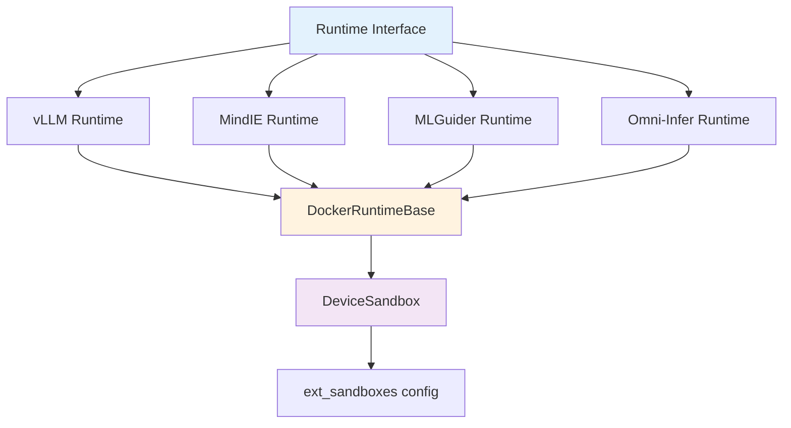

XW CLI supports multiple inference engine backends, each optimized for different hardware and use cases. All engines run in Docker containers with standardized lifecycle management.

## Supported Engines

<CardGroup cols={2}>
  <Card title="vLLM" icon="gauge-high">
    High-performance PagedAttention with broad hardware support
  </Card>
  <Card title="MindIE" icon="brain">
    Huawei-optimized engine for Ascend NPUs
  </Card>
  <Card title="MLGuider" icon="wand-magic-sparkles">
    MoE and expert parallelism for large models
  </Card>
  <Card title="Omni-Infer" icon="star">
    Simplified API with minimal dependencies
  </Card>
</CardGroup>

## Architecture Overview

All runtime engines implement a common interface and use Docker for isolation:



### Common Runtime Interface

All engines implement the `runtime.Runtime` interface:

```go
// From internal/runtime/types.go:14-24
type Runtime interface {
    Create(ctx context.Context, params *CreateParams) (*Instance, error)
    Start(ctx context.Context, instanceID string) error
    Stop(ctx context.Context, instanceID string) error
    Remove(ctx context.Context, instanceID string) error
    Get(ctx context.Context, instanceID string) (*Instance, error)
    List(ctx context.Context) ([]*Instance, error)
    Logs(ctx context.Context, instanceID string, follow bool) (LogStream, error)
    Name() string
}
```

**Source:** `internal/runtime/types.go:14-24`

## vLLM Runtime

### Overview

vLLM is a high-throughput LLM serving engine with PagedAttention for efficient memory management. XW uses vLLM as the default engine for most models.

<Info>
vLLM's PagedAttention algorithm inspired by virtual memory paging reduces memory waste and enables larger batch sizes, significantly improving throughput.
</Info>

### Key Features

- **PagedAttention:** Efficient KV cache management
- **Continuous Batching:** Dynamic request batching for high throughput
- **Tensor Parallelism:** Multi-device model sharding
- **Broad Compatibility:** Supports Ascend 910B, 310P, MetaX C550
- **OpenAI API:** Drop-in replacement for OpenAI endpoints

### Configuration

**Docker Image (Ascend 910B arm64):**
```
harbor.tsingmao.com/xw-cli/vllm-ascend:v0.14.0rc1-arm64
```

**Device Environment:**
```bash
ASCEND_RT_VISIBLE_DEVICES=0,1,2,3
ASCEND_VISIBLE_DEVICES=0,1,2,3,4,5,6,7
ASCEND_SLOG_PRINT_TO_STDOUT=1
ASCEND_GLOBAL_LOG_LEVEL=3
```

**Container Resources:**
- Privileged mode: Yes
- Shared memory: 100GB
- Capabilities: `SYS_ADMIN`, `SYS_RAWIO`, `IPC_LOCK`, `SYS_RESOURCE`

**Source:** `configs/0.0.3/devices.yaml:45-95`

### Sandbox Configuration

From `internal/runtime/vllm-docker/doc.go:23-39`:

```yaml
ext_sandboxes:
  # Common configuration
  devices:
    - /dev/davinci0
    - /dev/davinci_manager
  volumes:
    - /usr/local/Ascend/driver:/usr/local/Ascend/driver
    - /root/.cache:/root/.cache
  runtime: runc
  # vLLM-specific
  vllm:
    device_env: ASCEND_RT_VISIBLE_DEVICES
    privileged: true
    shm_size_gb: 100
```

### Usage Example

```bash
# Start vLLM instance with tensor parallelism
xw run qwen2.5-7b-instruct \
  --backend vllm \
  --tp 4 \
  --port 8000

# Make inference request
curl http://localhost:8000/v1/chat/completions \
  -H "Content-Type: application/json" \
  -d '{
    "model": "qwen2.5-7b-instruct",
    "messages": [{"role": "user", "content": "Hello"}]
  }'
```

## MindIE Runtime

### Overview

MindIE is Huawei's inference engine optimized specifically for Ascend NPUs. It provides advanced features like extensive logging for profiling and debugging.

### Key Features

- **Ascend-Optimized:** Native CANN runtime integration
- **Multi-Device Support:** Tensor and pipeline parallelism
- **Extensive Logging:** Profiling data, system logs, core dumps
- **WORLD_SIZE Management:** Automatic parallel configuration
- **Production Ready:** Battle-tested on Ascend 910B and 310P

### Configuration

**Docker Image (Ascend 910B arm64):**
```
harbor.tsingmao.com/xw-cli/mindie:2.2.RC1-800I-A2-py311-openeuler24.03-lts-arm64
```

**Device Environment:**
```bash
MINDIE_NPU_DEVICE_IDS=0,1,2,3
WORLD_SIZE=4
TENSOR_PARALLEL=4
PIPELINE_PARALLEL=1
```

**Container Resources:**
- Privileged mode: Yes
- Shared memory: 100GB
- Capabilities: `SYS_ADMIN`, `SYS_RAWIO`, `IPC_LOCK`, `SYS_RESOURCE`, `NET_ADMIN`

**Source:** `configs/0.0.3/devices.yaml:49-106`

### MindIE-Specific Features

From `internal/runtime/mindie-docker/doc.go:54-68`:

<CardGroup cols={2}>
  <Card title="Device Visibility" icon="eye">
    Uses `MINDIE_NPU_DEVICE_IDS` instead of Ascend's default variable
  </Card>
  <Card title="Log Directories" icon="folder-tree">
    Requires extensive log mounts for profiling and diagnostics
  </Card>
  <Card title="Multi-Device" icon="network-wired">
    WORLD_SIZE must match TENSOR_PARALLEL × PIPELINE_PARALLEL
  </Card>
  <Card title="CANN Integration" icon="link">
    Direct integration with Ascend CANN runtime libraries
  </Card>
</CardGroup>

### Log Directory Structure

```bash
# System logs from CANN runtime
/var/log/npu/slog/

# Performance profiling data
/var/log/npu/profiling/

# Core dumps and diagnostics
/var/log/npu/dump/
```

### Usage Example

```bash
# Start MindIE instance
xw run qwen2.5-7b-instruct \
  --backend mindie \
  --tp 4 \
  --port 8001

# Check profiling logs
xw logs qwen2.5-7b-instruct
```

## MLGuider Runtime

### Overview

MLGuider is optimized for large language models on Ascend 310P with support for Mixture-of-Experts (MoE) models and dual model directory management.

### Key Features

- **MoE Support:** Expert parallelism for models like Mixtral
- **Model Conversion:** Automatic HuggingFace → MLGuider format
- **Dual Directories:** Separate original and converted model storage
- **Tensor Parallelism:** Multi-device model sharding
- **Bridge Networking:** Port mapping for multi-instance support

### Configuration

**Docker Image (Ascend 310P arm64):**
```
harbor.tsingmao.com/xw-cli/mlguider:0123-310p-arm64
```

**Device Environment:**
```bash
DEVICES=0,1,2,3
TENSOR_PARALLEL=4
EXPERT_PARALLEL=1
WORLD_SIZE=4
ORIGIN_MODEL_PATH=/mnt/model
MODEL_PATH=/data/converted
```

**Container Resources:**
- Privileged mode: Yes
- Shared memory: 100GB
- Capabilities: `SYS_ADMIN`, `SYS_RAWIO`, `IPC_LOCK`, `SYS_RESOURCE`, `NET_ADMIN`
- Networking: Bridge with port mapping

**Source:** `configs/0.0.3/devices.yaml:139-204`

### Dual Model Directory Support

From `internal/runtime/mlguider-docker/doc.go:66-89`:

**Pattern 1: Single Directory**
```bash
# Mount original model only
# MLGuider converts on first run
xw run llama-3-70b --backend mlguider
```

**Pattern 2: Separate Directories**
```bash
# Mount original + cache for converted models
# Faster startup with pre-converted models
xw run llama-3-70b \
  --backend mlguider \
  --data-dir /data/converted/llama-3-70b
```

<Info>
Converted models can be reused across container restarts, avoiding repeated conversion overhead for large models.
</Info>

### Parallelism Configuration

```go
// From internal/runtime/mlguider-docker/doc.go:56-58
TENSOR_PARALLEL: 4    // Tensor parallelism across devices
EXPERT_PARALLEL: 1    // Expert parallelism for MoE models
WORLD_SIZE: 4         // Must equal TENSOR_PARALLEL * EXPERT_PARALLEL
```

### Usage Example

```bash
# Run MoE model with expert parallelism
xw run mixtral-8x7b \
  --backend mlguider \
  --tp 4 \
  --config expert_parallel=2 \
  --port 8002
```

## Omni-Infer Runtime

### Overview

Omni-Infer is a simplified inference engine with minimal dependencies and straightforward configuration. It's the easiest runtime to deploy.

### Key Features

- **Simple API:** Minimal configuration required
- **Host Networking:** Optimal performance with `--net=host`
- **Large Shared Memory:** 500GB default for large model support
- **Minimal Mounts:** Only essential Ascend driver and DCMI
- **Low Complexity:** Straightforward deployment and debugging

### Configuration

**Docker Image (Ascend 910B arm64):**
```
harbor.tsingmao.com/xw-cli/omniinfer-a2-arm:release_v0.8.0-vllm-xw
```

**Device Environment:**
```bash
ASCEND_RT_VISIBLE_DEVICES=6,7,8,9
MODEL_PATH=/mnt/model
MODEL_NAME=qwen2.5-7b-instruct
TENSOR_PARALLEL_SIZE=4
MAX_MODEL_LEN=32768
SERVER_PORT=8000
```

**Container Resources:**
- Privileged mode: Yes
- Shared memory: 500GB (largest)
- Capabilities: `SYS_ADMIN`, `SYS_RAWIO`, `IPC_LOCK`, `SYS_RESOURCE`
- Networking: Host

**Source:** `configs/0.0.3/devices.yaml:53-116`

### Minimal Volume Mounts

From `internal/runtime/omni-infer-docker/doc.go:60-61`:

```yaml
volumes:
  - /usr/local/Ascend/driver:/usr/local/Ascend/driver:ro
  - /usr/local/dcmi:/usr/local/dcmi:ro
```

<Note>
Read-only mounts for driver and DCMI keep the container lightweight and secure.
</Note>

### Usage Example

```bash
# Start Omni-Infer with host networking
xw run qwen2.5-7b-instruct \
  --backend omni-infer \
  --tp 4 \
  --config max_model_len=32768

# Access via host network
curl http://localhost:8000/v1/chat/completions \
  -H "Content-Type: application/json" \
  -d '{
    "model": "qwen2.5-7b-instruct",
    "messages": [{"role": "user", "content": "Hello"}]
  }'
```

## Engine Comparison

### Feature Matrix

| Feature | vLLM | MindIE | MLGuider | Omni-Infer |
|---------|------|--------|----------|------------|
| **Hardware** |||||
| Ascend 910B | ✅ | ✅ | ❌ | ✅ |
| Ascend 310P | ✅ | ✅ | ✅ | ❌ |
| MetaX C550 | ✅ | ❌ | ❌ | ❌ |
| **Parallelism** |||||
| Tensor Parallel | ✅ | ✅ | ✅ | ✅ |
| Pipeline Parallel | ❌ | ✅ | ❌ | ❌ |
| Expert Parallel | ❌ | ❌ | ✅ | ❌ |
| **Deployment** |||||
| Networking | Bridge | Bridge | Bridge | Host |
| Shared Memory | 100GB | 100GB | 100GB | 500GB |
| Log Mounts | Minimal | Extensive | Extensive | Minimal |
| Complexity | Medium | High | High | Low |
| **API** |||||
| OpenAI Compatible | ✅ | ✅ | ✅ | ✅ |
| Model Conversion | ❌ | ❌ | ✅ | ❌ |

### Use Case Recommendations

<CardGroup cols={2}>
  <Card title="vLLM" icon="gauge-high">
    **Best for:** General-purpose inference, broad hardware support
    
    Choose when you need PagedAttention efficiency and multi-vendor support.
  </Card>
  
  <Card title="MindIE" icon="brain">
    **Best for:** Production Ascend deployments, profiling
    
    Choose when you need extensive logging and Huawei-optimized performance.
  </Card>
  
  <Card title="MLGuider" icon="wand-magic-sparkles">
    **Best for:** MoE models, Ascend 310P, model conversion
    
    Choose for Mixtral-like models or when you need expert parallelism.
  </Card>
  
  <Card title="Omni-Infer" icon="star">
    **Best for:** Simple deployments, large models
    
    Choose when you want minimal configuration and maximum shared memory.
  </Card>
</CardGroup>

## Configuration-Driven Architecture

All runtimes use the **ext_sandboxes** system for device configuration:

### Configuration Structure

```yaml
# From configs/0.0.3/devices.yaml
ext_sandboxes:
  # Common config (all engines)
  devices:
    - /dev/davinci0      # Per-device (auto-matched)
    - /dev/davinci_manager  # Shared device
  volumes:
    - /usr/local/Ascend/driver:/usr/local/Ascend/driver
  runtime: runc
  
  # Engine-specific overrides
  vllm:
    device_env: ASCEND_RT_VISIBLE_DEVICES
    privileged: true
    shm_size_gb: 100
  
  mindie:
    device_env: MINDIE_NPU_DEVICE_IDS
    capabilities:
      - NET_ADMIN  # Additional capability
```

### Benefits

From `internal/runtime/vllm-docker/doc.go:13-17`:

<CardGroup cols={2}>
  <Card title="No Recompilation" icon="code">
    Add new chips by editing YAML
  </Card>
  <Card title="Quick Updates" icon="bolt">
    Change driver paths without rebuilding
  </Card>
  <Card title="User Customization" icon="wrench">
    Users can adapt to their environment
  </Card>
  <Card title="Rapid Iteration" icon="rotate">
    Faster deployment cycles
  </Card>
</CardGroup>

## Implementation Details

### DockerRuntimeBase

All engines inherit from a common base class:

```go
// Shared functionality:
- Container lifecycle (create, start, stop, remove)
- Image pulling and caching
- Device mounting and environment setup
- Health checking and readiness detection
- Log streaming
- Label-based state management
```

**Source:** `internal/runtime/docker_base.go`

### Device Sandbox Selection

From `internal/runtime/vllm-docker/doc.go:168-175`:

**Priority Order:**
1. Extended sandboxes from `configs/devices.yaml` (highest)
2. Core sandboxes registered via `RegisterCoreSandboxes()`
3. Error if no sandbox found

<Note>
Configuration always overrides code, allowing users to customize behavior without modifying binaries.
</Note>

## Adding Custom Engines

### Implementation Steps

1. **Implement Runtime Interface**

```go
type CustomRuntime struct {
    *runtime.DockerRuntimeBase
}

func (r *CustomRuntime) Create(ctx context.Context, params *runtime.CreateParams) (*runtime.Instance, error) {
    // Custom logic here
    return r.DockerRuntimeBase.CreateContainer(ctx, params)
}
```

2. **Register Runtime**

```go
func init() {
    runtime.RegisterRuntime(NewCustomRuntime())
}
```

3. **Add Configuration**

```yaml
# devices.yaml
runtime_images:
  custom-engine:
    arm64: harbor.example.com/custom:latest

ext_sandboxes:
  custom-engine:
    device_env: CUSTOM_VISIBLE_DEVICES
    privileged: true
```

## Next Steps

<CardGroup cols={2}>
  <Card title="Device Support" href="/concepts/device-support" icon="microchip">
    Learn about hardware detection and allocation
  </Card>
  <Card title="Model Management" href="/concepts/model-management" icon="database">
    Understand model registry and pulling
  </Card>
  <Card title="Architecture" href="/concepts/architecture" icon="diagram-project">
    Explore the overall system design
  </Card>
  <Card title="CLI Reference" href="/cli/run" icon="terminal">
    See runtime engine CLI commands
  </Card>
</CardGroup>